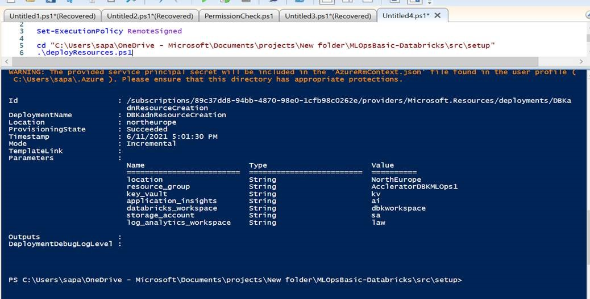

About this repository
============================================================================================================================================
This respository contains the Databricks development framework for delivering any Data Engineering projects, and machine learning projects based on the Azure Technologies.


Details of the accelerator
============================================================================================================================

The acclerator contains few of the core features of databricks development which can be extended or reused in any implementation projects with databricks. 

- Logging Framework using the [Opensensus Azure Monitor Exporters](https://github.com/census-instrumentation/opencensus-python/tree/master/contrib/opencensus-ext-azure)
- Support for Databricks development from VS Code IDE using the [Databricks Connect](https://docs.microsoft.com/en-us/azure/databricks/dev-tools/databricks-connect#visual-studio-code) feature.
- continous development with [Python Local Packaging](https://packaging.python.org/tutorials/packaging-projects/)
- Implementation of the databricks utilties in VS Code such as dbutils, notebook execution, secret handling. 
- Exampler Model file which uses the framework end to end.

Prerequisites
============================================================================================================================

In order to successfully complete your solution, you will need to have access to and or provisioned the following:

-   Access to an Azure subscription
-   Service Principal (valid Client ID and secret ) which has the contributor permission the subscription. We are going to create the resource group using the service principal.
-   VS Code installed. 
-   Docker Desktop Installed.


Getting Started
================================================================================================================================

The below sections provide the step by step approach to set up the solution. As part of this solution, we need the following resources to be provisioned in a resource group. 

1. Azure Databricks
2. Application Insight Instance.
3. A log analytics workspace for the App Insight.
4. Azure Key Vault to store the secrets.
5. A Storage Account. 


## Section 1: Docker Image Load in VS Code

1.	Clone the Repository : https://github.com/microsoft/dstoolkit-ml-ops-for-databricks/pulls
2.	Install Docker Desktop. In this solution, the Visual Code uses the docker image as a remote container to run the solution.
3.	Create .env file in the root folder, and keep the file blank for now.
4.	In the repo, open the workspace. File: workspace.ode-workspace. 
    > Once you click the file, you will get the "Open Worskpace" button at right bottom corner in the code editor. Click it to open the solution into the vscode workspace.


5. We need to connect to the docker image as remote container in vs code. In the code repository, we have ./.devcontainer folder that has required docker image file and docker configuration file. Once we load the repo in the vscode, we generally get the prompt. Select "Reopen in Container"

<p align="center">

</p>

6. In the background, it is going to build a docker image. We need to wait for sometime to complete the all the steps. the docker image will basically contain the a linux environment which has python 3.7 installed. Please have a look at the configuration file(.devcontainer\devcontainer.json) for more details. 
7. Once it is loaded. we will be able to see the python interpreter is loaded successfully. Incase it does not show, then click on the select python interpreter => Entire workspace => /usr/local/bin/python


8.	You will be prompted with installing the required extension on the right bottom corner. Install it.


9.	The python extension should be shown as below 


## Section 2: Data bricks Environment creation

This  demo basically creates a new Databricks workspace and cluster. If you would like to reuse the existing workspace and cluster, You can skip this section
 
1. Go to src/setup/config/setup_config.json, and complete the json files with the values; according to your environment 
```
{
 
    "applicationID":"deeadfb5-27xxxaad3-9fd39049b450",
    "tenantID":"72f988bf-8xxxxx2d7cd011db47",
    "subscriptionID":"89c37dd8xxxx-1cfb98c0262e",
    "resourceGroupName":"AccleratorDBKMLOps2",
    "resourceGroupLocation":"NorthEurope"
}
```
 
2. create the file and provide the client ID secret in this file : src/vault/appsecret.txt  [Do it from the Local file system, not from the docker]
3. Open the Powershell ISE in your local machine, as we are going to run couple of powershell scripts.
4.set the root path of the Powershell terminal till setup, and execute the deployResource.ps1
 ```
cd "C:\Users\sapa\OneDrive - Microsoft\Documents\projects\New folder\MLOpsBasic-Databricks\src\setup"
.\deployResources.ps1
 ```
>a.	If you receive the below error, execute the  command [
Set-ExecutionPolicy RemoteSigned]

```
.\deployResources.ps1 : File C:\Users\sapa\OneDrive - Microsoft\Documents\projects\New 
folder\MLOpsBasic-Databricks\src\setup\deployResources.ps1 cannot be loaded because running scripts is disabled on this.
```



## Section 3: Databricks Cluster Creation

1.	To create the databricks cluster we need to have personal Access token created. Go to the Databricks workspace, and get the personal access token from the user setting, and save it in the file src/vault/DBKtoken.txt
2.	Run the following command
 
 ```
cd "C:\Users\sapa\OneDrive - Microsoft\Documents\projects\New folder\MLOpsBasic-Databricks\src\setup"
 
.\configureResources.ps1
 ```
3.	Copy the output of the script and paste it to the .env file which you have created previously 

## Section 4: Create the .env file


1.	We need to manually change the databricks host and appI_IK values. Other values should be as is from the output from the previous script.
APPI_K = connection string of the application insight
 
 ```
 
PYTHONPATH=/workspaces/MLOpsBasic-Databricks/src/modules
APPI_IK=InstrumentationKey=e6221ea6-a3b9-4739-918f-8a0985a1502f;IngestionEndpoint=https://northeurope-2.in.applicationinsights.azure.com/
DATABRICKS_HOST=https://adb-7936878321001673.13.azuredatabricks.net
DATABRICKS_TOKEN= <Provide the secret>
DATABRICKS_ORDGID=7936878321001673
```

## Section 5: Configure the databricks connect

1.	In this step we are going to configure the databricks connect , so that the VS code can connect to the databricks. Run the below command for that from the docker terminal.

 ```
python "src/tutorial/scripts/local_config.py" -c "src/tutorial/cluster_config.json"
 ```
>Note: If you get any error saying that "model not found". Try to reload the VS code window and see if you are getting prompt  right bottom corner saying that configuration file changes, rebuild the docker image. Rebuild it and then reload the window. Post that you would not be getting any error. 
 
#### Verify :
1.	You will be able to see the message All tests passed.


## Section 6:  Create the private package(.whl) and upload to the workspace.
1.	Run the below command:
python src/tutorial/scripts/install_dbkframework.py -c "src/tutorial/cluster_config.json"
 
Post  Execution of the script, we will be able to see the module to be installed.


## Section 7: Using the framework.
 
To check if the framework is working fine or not, lets execute this file : **src/tutorial/remote_analysis.py**
Post running the script, we will be able to see the data in the terminal 

